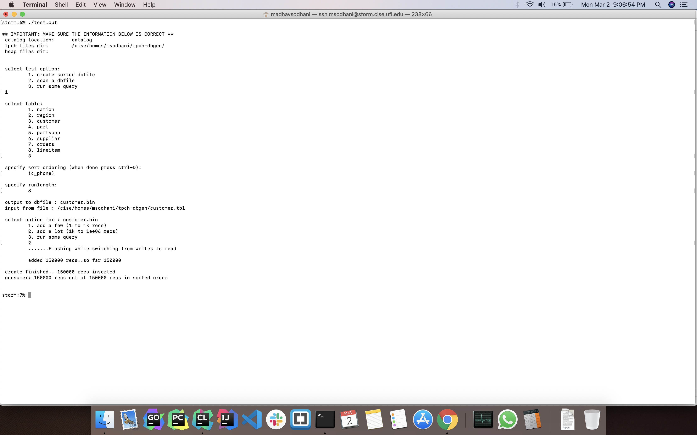
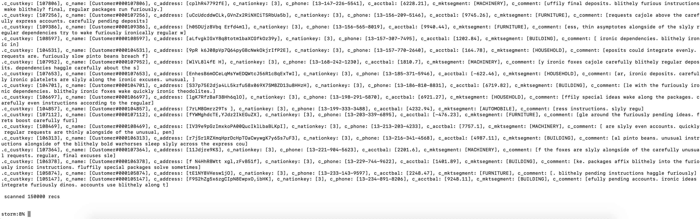
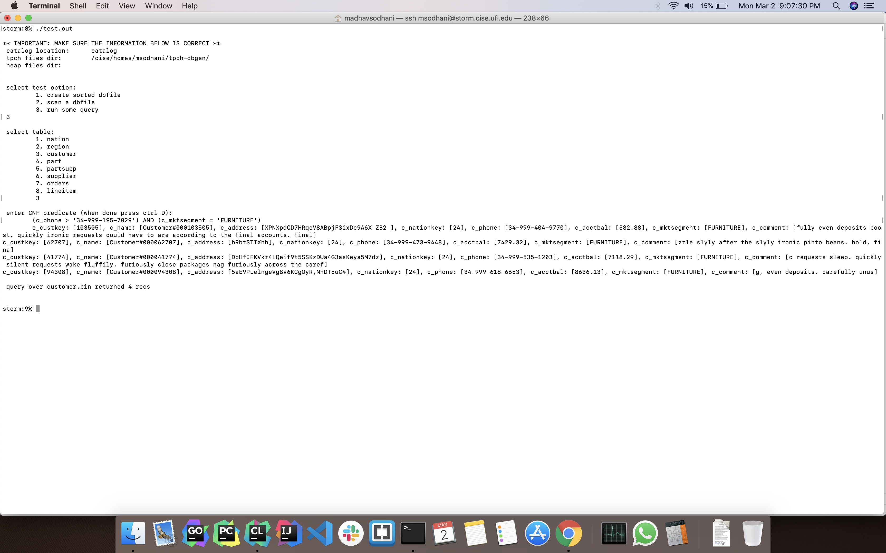
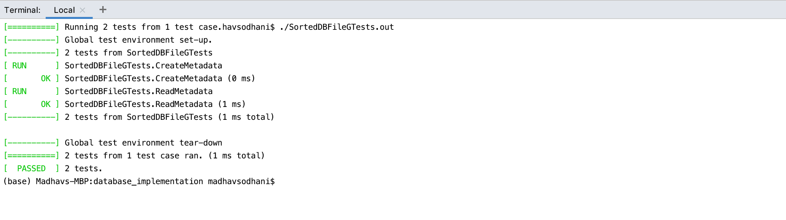

## Assignment 2 Milestone 2: Implementing a Sorted File  
  
#### Group Members - 
1. Madhav Sodhani (1988-9109)  
  
**Note** : Update tpch directory in **test.h** file  
  
#### Instructions to execution and code compilation -  
1. Once the code has been extracted, please navigate to the project root with the makefile  
2. Execute the test driver with the following commands  

		 make clean 
		 make test.out
 
4. Run test provided in _What to turn in_ by executing below code:  
      
		 ./test.out

5. Provide inputs provided in _What to turn in_

--- 

### Implementation details - 
We have implemented GenericDBFile as base class, added HeapDBFile and SortedDBFile as sub-classes. Now, DBFile is just a wrapper which calls instance of HeapDBFile or SortedDBFile depending upon the file type passed in Create method.

HeapDBFile is the same implementation which was previously done in DBFile for heap implementation. We have refactored common methods into GenericDBFile and different methods are moved into HeapDBFile.

#### Common Methods b/w Heap and Generic implementation - 
1. Open 
2. Close
3. Load
4. GetNext (w/o CNF)
5. WriteMetadata - It is an abstract method which writes information regarding the file into a metadata file which can be used later. 
	-	Heap Files - It writes the file type only
	-	Sorted Files - It write information about file type, run length and order maker attributes
6. ReadMetadata - It is an abstract method which reads information according to it's file type

#### Methods implemented in SortedDBFile - 
1. Create - It initialize sort info for the sort file.
2. Add - It adds the record into the input pipe of BigQ instance
3. GetNext (w/ CNF) - When there is some common part b/w sort info and CNF passed to GetNext, we use binary search to find the page where the similar record can be found as we have already sorted the data. If there is no similarity then it will work same as Heap file implementation i.e. linear search through all the records.
4. PerformBinarySearch (private) - It is a private method, which perform binary search on the existing file to find the page according to query. It moves the cursor to a previous page, on which we can find similar record to query.

#### Method implemented in CNF - 
1. GetSortOrder - It is used to create the query i.e. common attributes b/w the sort order of file and the CNF, which should be in order of sort order of file.

---

### Results of tests cases ran on 1 GB data - 
1. Create sorted dbfile
    
    
    
1. Scan a dbfile

    

1. Run some query

    
    
-----
    
### GTests

**Instruction to run GTests**

    make clean
    make SortedDBFileGTests.out
    ./SortedDBFileGTests.out
    
    
    
GTests are for the following functionality -
1. Create method should create a metadata file
1. Information read in metadata file should be correct

    